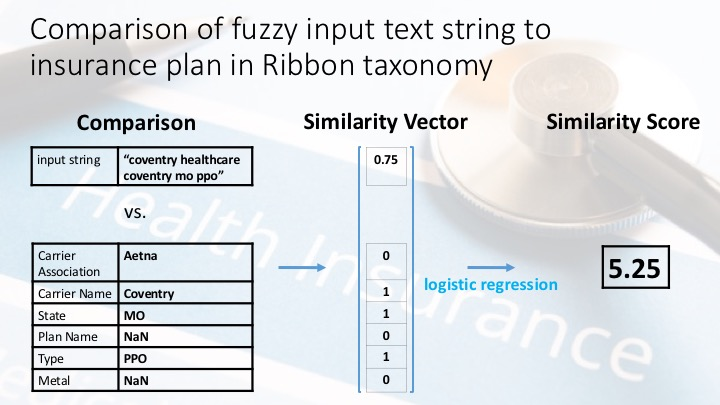

# PlanIt Health
Python package to map fuzzy text strings describing insurance plans into taxonomy of distinct insurance plans. This helps [Ribbon Health](https://www.ribbonhealth.com/) process and provide information connecting health plans to providers.

This package was built for a 3-week consulting project with Ribbon Health as part of the [Insight Data Science](https://www.insightdatascience.com/) program.

## Repository content

* The python package with the main functionality is contained in the [classify_insurance](classify_insurance) folder. The package consists of three modules:

    * [planmapper.py](classify_insurance/planmapper.py): defines PlanComparisonModel class. A model (i.e. an instance of this class) performs comparison of input text string to insurance plans in taxonomy.
    * [inputwithmappings.py](classify_insurance/inputwithmappings.py): defines InputWithMappings class. An instance of this class contains an input string and information on how it compares with plans in the taxonomy.
    * [simvec2score.py](classify_insurance/simvec2score.py): defines SimilarityVectorToScore class. An instance of this class maps a similarity vector (between an input string and an insurance plan) to a similarity score.

 * Example script(s) for how to use the code in the package is/are contained in the [Scripts](Scripts) folder:
    * [examples_planmapper.py](Scripts/examples_planmapper.py): select an input string and use code in the classify_insurance package to recommend matching plan(s).

* The [Data](data) folder would contain input data. However, because of the proprietary nature, this is <b>not</b> included in this repository.

    * [Data/Insurance Mappings RIbbon.xlsx](Data/Insurance Mappings RIbbon.xlsx): Excel file with insurance taxonomy and mapped inputs.

* Pickled model(s) for mapping similarity vectors to scores are located in the [Models](models) folder:
    * [Models/logreg_default.sav](Models/logreg_default.sav): logistic regression model.

* [Figures](Figures) folder contains illustrative image(s).

## Details

The main work flow this code enables is the following. This flow is illustrated in the script [examples_planmapper.py](Scripts/examples_planmapper.py).

The input is a fuzzy text string describing an insurance plan. This string could be the text identifying a plan on the website of the carrier, e.g.

"bcbs - blue shield CA Access Plus HMO".

The code then compares this string to all insurance plans defined in Ribbon's taxonomy of plans (see image below). For each comparison, it first computes a similarity vector. This vector consists of a number of features quantifying how well different properties of the insurance plan match the input string. These features are then converted to a probability for the input and plan to be a match using logistic regression. This probability (or actually a remapping of it) is called the similarity score. Once similarity scores have been computed for all plans in the taxonomy, the algorithm recommends as matches all 1 or more plans within some margin of the top score.

